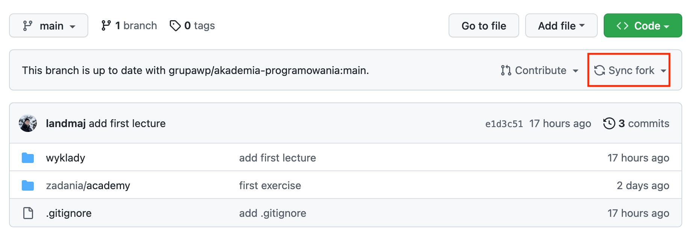

# Instrukcja

## W trakcie zajęć lub w ramach (opcjonalnej) pracy domowej będziemy wam udostępniać zadania

By je wykonać, sklonujcie to repozytorium:

```bash
❯ git clone git@github.com:grupawp/akademia-programowania-2.git
Cloning into 'akademia-programowania-2'...
remote: Enumerating objects: 17, done.
remote: Counting objects: 100% (17/17), done.
remote: Compressing objects: 100% (13/13), done.
remote: Total 17 (delta 0), reused 17 (delta 0), pack-reused 0
Receiving objects: 100% (17/17), 853.52 KiB | 1.32 MiB/s, done.
```

## Po ukończeniu zadania zapewne będziecie chcieli się nim z nami podzielić

W tym celu zróbie fork:


Po chwili czekania na waszym koncie zostanie utworzone nowe repozytorium, a wy
zostaniecie tam automatycznie przekierowani. Teraz trzeba dodać je w gicie jako
nowy remote. Potrzebujecie do tego adres waszego repozytorium - będzie wyglądał
identycznie jak oryginalny, a jedyną różnicą jest wasz login w miejscu oryginalnego
`grupawp`.

```bash
~/wp/akademia-programowania-2 main 
❯ git remote add fork git@github.com:login/akademia-programowania-2.git

~/wp/akademia-programowania-2 main
❯ git remote
fork
origin
```

Teraz zacommitujcie swoje zmiany:

```bash
~/wp/akademia-programowania-2 main
❯ git add *

~/wp/akademia-programowania-2 main
❯ git commit -m "rozwiązanie zadania #1"
```

A następnie zróbcie pusha, podając remote do którego chcecie wypchnąć zmiany:

```bash
~/wp/akademia-programowania-2 main
❯ git push fork main
Total 0 (delta 0), reused 0 (delta 0), pack-reused 0
To github.com:login/akademia-programowania-2.git
   e1d3c51..704df65  main -> main
```

Jeśli zobaczycie błąd, to najprawdopodobniej nie podaliście nazwy remote i git próbuje
wypchnąć zmiany do domyślnego remote'a dodanego w trakcie pierwotnego klonowania repozytorium
(nazwany origin), a błąd bierze się z powodu braku uprawnień.

By udostępnić nam swoje rozwiązanie, wystarczy że prześlecie nam link do swojego repozytorium.

W miarę pojawiania się kolejnych zadań będziecie potrzebowali zsynchronizować swojego forka
z upstreamem. GitHub pozwala zrobić to całkiem prosto.



Możliwe że zdarzy wam się konflikt uniemożliwiający zsynchronizowanie forka, ale rozwiązywanie
konfliktów wykracza poza tę instrukcję. Polecam narzędzie do nauki Gita, o którym wspominał
Kamil Pastor w ramach jednego z pierwszych wykładów:
[Learn Git Branching](https://learngitbranching.js.org/?locale=pl)
